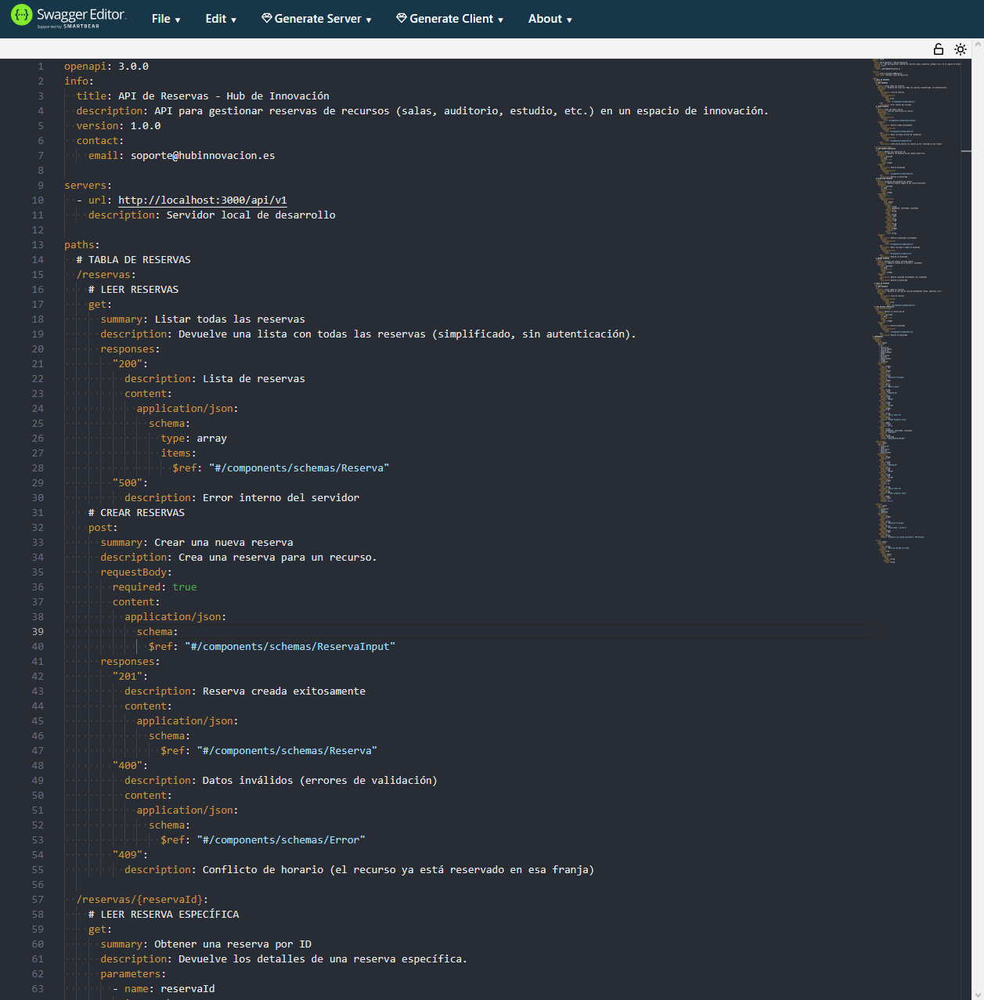
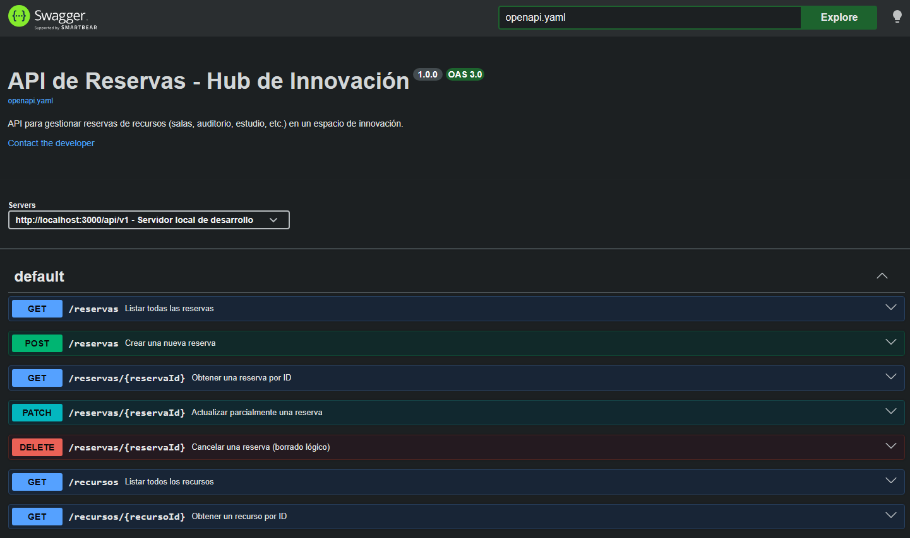
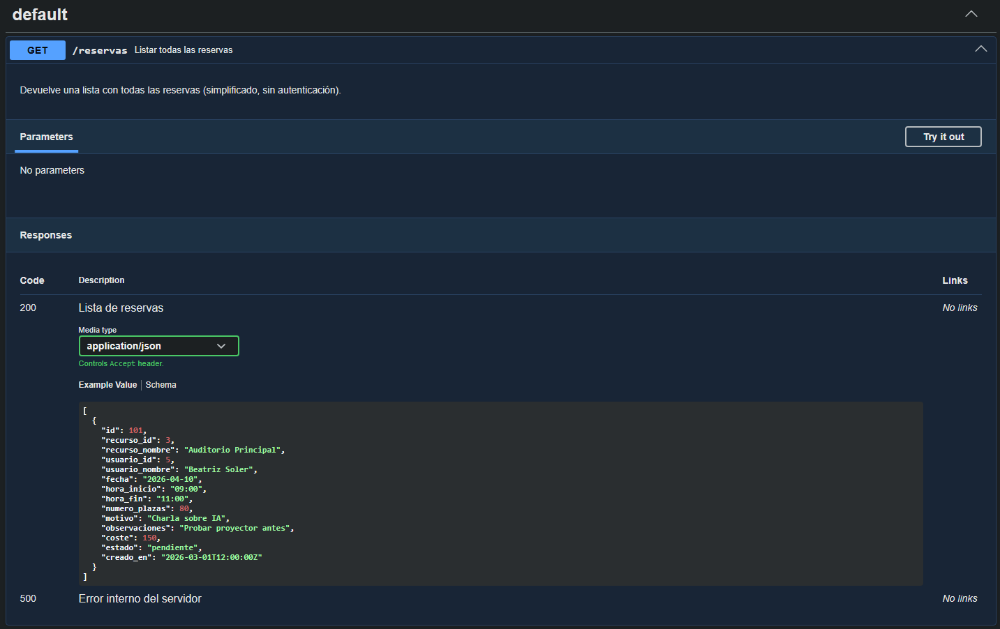
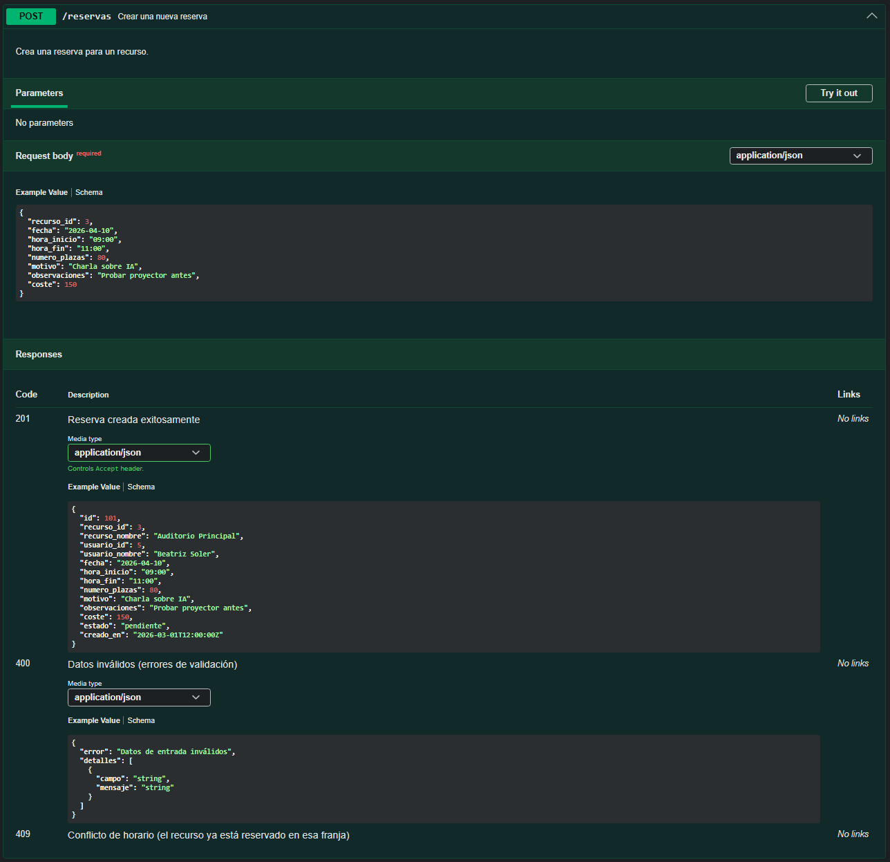
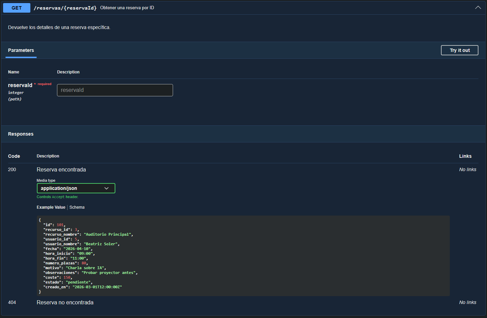
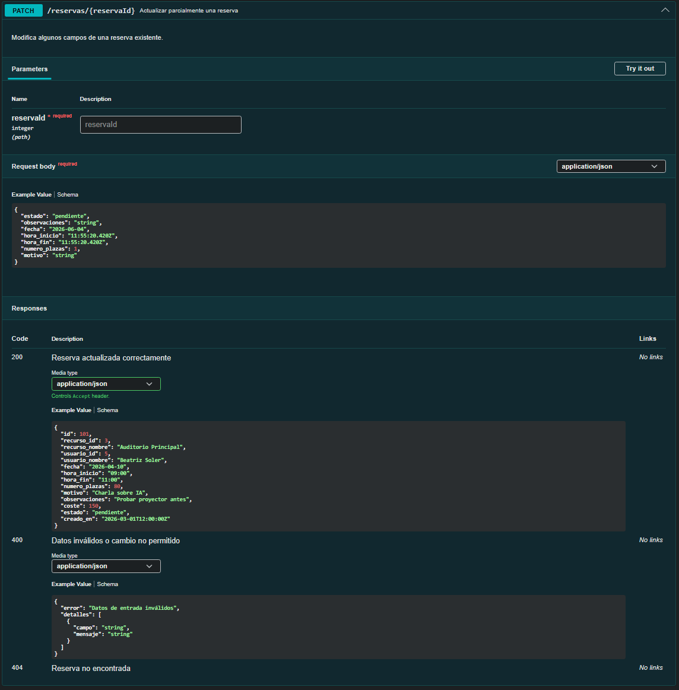
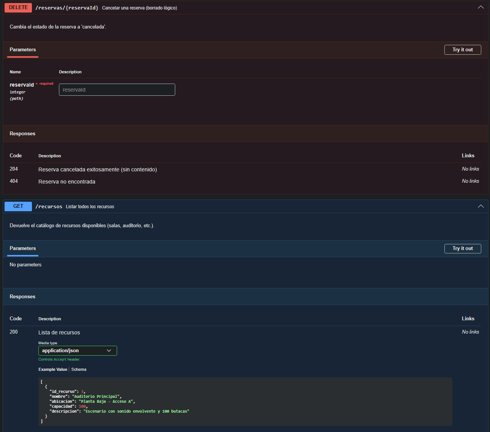
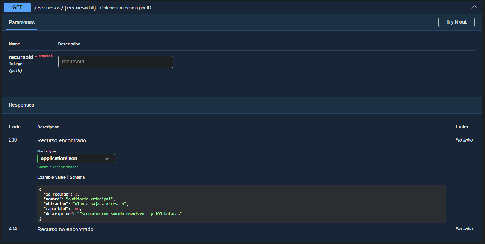
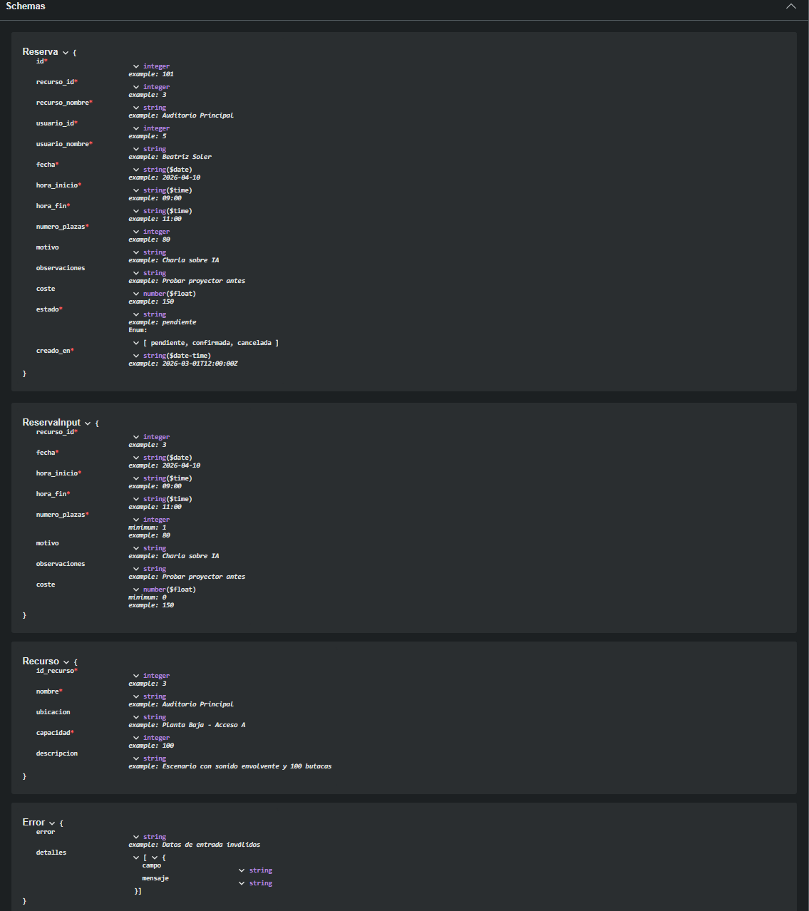

# Análisis del Dominio - API del Sistema de Reservas (Hub de Innovación)

**Proyecto Intermodular - Diseño de API REST**
**Autor:** Raúl Cayuela Maciá
**Tema:** Gestión de reservas de recursos (salas, auditorio, estudio, etc.) en un espacio de innovación.

## 1. Tablas de la base de datos que usaré

---

Para dar soporte a las operaciones CRUD de reservas necesito estas tablas:

- `RESERVA` (entidad principal)
- `RECURSO` (lo que se reserva: sala, auditorio, terraza, etc.)
- `USUARIONORMAL` (usuario que realiza la reserva, subtabla de `USUARIO`)
- `USUARIO` (tabla base de usuarios, contiene correo, nombre, etc.)

## 2. Campos de las tablas y mapeo a la API

---

### Tabla: RESERVA

| Campo | Tipo | ¿En API? | Razón |
| --- | --- | :---: | --- |
| `id` (añadido) | INT | Sí | Identificador único para la API. En la BD la PK es compuesta (`id_recurso`, `id_reserva_local`); le añadiría una clave para simplificar las operaciones REST. |
| `id_recurso` | INT (FK) | Sí | Identifica qué recurso se reserva. |
| `id_usuario` | INT (FK) | Sí (solo lectura) | Quién realiza la reserva. |
| `fecha` | DATE | Sí | Día de la reserva. |
| `hora_inicio` | TIME | Sí | Hora de inicio. |
| `hora_fin` | TIME | Sí | Hora de fin. |
| `coste` | DECIMAL(10,2) | Sí | Precio del recurso. |
| `numero_plazas` | INT | Sí | Número de asistentes / plazas ocupadas. |
| `motivo` | TEXT | Sí | Descripción del motivo de la reserva. |
| `observaciones` | TEXT | Sí | Notas adicionales. |
| `estado` (añadido) | ENUM | Sí | Estado de la reserva: `pendiente`, `confirmada`, `cancelada`. |
| `creado_en` (añadido) | TIMESTAMP | Sí | Fecha de creación del registro. |

**Campos auto-generados por el backend:**

- `id` (AUTO_INCREMENT)
- `estado` (por defecto `'pendiente'`)
- `creado_en` (timestamp actual)

### Tablas relacionadas (solo lectura en la API)

#### RECURSO

| Campo | Tipo | ¿En API? | Razón |
| :--- | :--- | :---: | :--- |
| `id_recurso` | INT | Sí | Identificador. |
| `nombre` | VARCHAR | Sí | Para mostrar en las respuestas. |
| `ubicacion` | VARCHAR | Sí | Ubicación dentro del hub. |
| `capacidad` | INT | Sí | Aforo máximo. |

En las respuestas de reservas se incluirá `recurso_nombre` (mediante JOIN) para facilitar la lectura.

#### USUARIO (a través de USUARIONORMAL)

| Campo | Tipo | ¿En API? | Razón |
| :--- | :--- | :---: | :--- |
| `nombre` | VARCHAR | Sí (solo lectura) | Nombre del usuario que reserva. |
| `correo_electronico` | VARCHAR | No | Por privacidad, no se expone. |

## 3. Validaciones principales

---

### Al crear/modificar una reserva validaré

**Campos obligatorios:**

- `recurso_id`, `fecha`, `hora_inicio`, `hora_fin`, `numero_plazas`

**Lógica de negocio:**

- `hora_inicio` < `hora_fin`
- `fecha` >= fecha actual (no reservas en pasado)
- `numero_plazas` >= 1 y <= capacidad del recurso (se obtiene de la tabla RECURSO)
- No solapamiento de horarios para el mismo recurso en la misma fecha (comprobar disponibilidad)
- `coste` si se envía debe ser >= 0; si no se envía, el backend lo calcula según tarifa del recurso.

**Estados permitidos:**

- Solo se puede modificar el estado si la reserva está `pendiente`.
- Los estados válidos son: `pendiente`, `confirmada`, `cancelada`.

### Al listar reservas

- Por defecto se devuelven solo las del usuario autenticado (filtro por `id_usuario` obtenido del token).

## 4. Ejemplos JSON (se pueden ver en la carpeta `2-ejemplos-json`)

---

**REQUEST** (crear reserva):

```json
{
  "recurso_id": 3,
  "fecha": "2026-04-10",
  "hora_inicio": "09:00",
  "hora_fin": "11:00",
  "numero_plazas": 80,
  "motivo": "Charla sobre IA",
  "observaciones": "Probar proyector antes"
}
```

Enlace al archivo: [```post-linea-request.json```](./2-ejemplos-json/post-reserva-request.json)

**RESPONSE 201** (reserva creada):

```json
{
  "id": 1,
  "recurso_id": 3,
  "usuario_id": 5,
  "recurso_nombre": "Auditorio Principal",
  "usuario_nombre": "Beatriz Soler",
  "fecha": "2026-04-10",
  "hora_inicio": "09:00",
  "hora_fin": "11:00",
  "numero_plazas": 80,
  "motivo": "Charla sobre IA",
  "observaciones": "Probar proyector antes",
  "coste": 150.00,
  "estado": "pendiente",
  "creado_en": "2026-03-01T12:00:00Z"
}
```

Enlace al archivo: [```post-reserva-response-201.json```](./2-ejemplos-json/post-reserva-response-201.json)

**RESPONSE 200** (listar reservas del usuario):

```json
[
  {
    "id": 1,
    "recurso_nombre": "Auditorio Principal",
    "fecha": "2026-04-10",
    "hora_inicio": "09:00",
    "hora_fin": "11:00",
    "numero_plazas": 80,
    "estado": "pendiente",
    "coste": 150.00
  },
  {
    "id": 2,
    "recurso_nombre": "Estudio de Podcast",
    "fecha": "2026-04-12",
    "hora_inicio": "10:00",
    "hora_fin": "11:30",
    "numero_plazas": 2,
    "estado": "confirmada",
    "coste": 45.00
  }
]
```

Enlace al archivo: [```get-reservas-response-200.json```](./2-ejemplos-json/get-reservas-response-200.json)

**ERROR 400** (validación fallida):

```json
{
  "error": "Datos de entrada inválidos",
  "detalles": [
    {
      "campo": "hora_fin",
      "mensaje": "La hora de fin debe ser posterior a la hora de inicio"
    }
  ]
}
```

Enlace al archivo: [```error-400.json```](./2-ejemplos-json/error-400.json)

**ERROR 500** (Internal Server Error):

```json
{
  "error": "Error interno del servidor",
  "detalles": [
    {
      "campo": "servidor",
      "mensaje": "No se pudo completar la solicitud. Consulte los logs para más información."
    }
  ]
}
```

Enlace al archivo: [```error-500.json```](./2-ejemplos-json/error-500.json)

## 5. Conclusión

---

Necesito **12** campos de la tabla **RESERVA** (expongo todos en la API, incluyendo el id añadido y el creado_en).
Aplicaré **6** validaciones básicas para garantizar la integridad de los datos:

- hora_inicio < hora_fin

- fecha >= fecha actual

- numero_plazas entre 1 y la capacidad del recurso

- No solapamiento de horarios para el mismo recurso en la misma fecha

- coste >= 0 (si se envía)

Comprobación de campos obligatorios (recurso_id, fecha, hora_inicio, hora_fin, numero_plazas).

El **MVP** permitirá:

- **Crear** una reserva (POST /reservas)

- **Listar** todas las reservas (GET /reservas)

- **Obtener** una reserva por ID (GET /reservas/{id})

- **Modificar** parcialmente una reserva (PATCH /reservas/{id})

- **Cancelar** una reserva (borrado lógico, DELETE /reservas/{id})

## 6. Validación con Swagger

---

A continuación se muestran capturas de pantalla de la especificación OpenAPI validada correctamente en Swagger Editor:



> [!NOTE]
> Como se puede ver en la validación con el editor no se muestra **ningún mensaje en rojo**.









> [!NOTE]
> Estas captura son diferentes **ejemplos** de los **Endpoints disponibles**.



> [!NOTE]
> Esta captura son los diferentes **Schemas** que hay además de un **ejemplo** del Schema de reserva.
